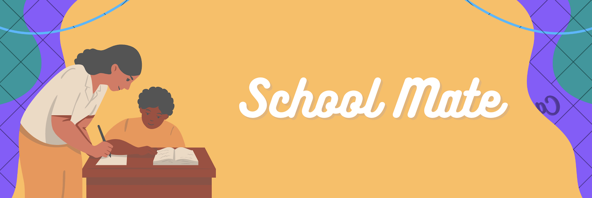

## CodeJam2022_McGill🙌
: CodeJam is the largest annual hackathon run by the McGill Electrical, Computer, and Software Engineering Student’ Society (usually in our very own Trottier Engineering Building). 

<h4>[ Duration ]🙋‍</h4>
- Nov 18, 2022 to Nov 20, 2022 (36 hrs)

 

<h4>[ Judges ]🙋‍</h4>
-<i> Matrox, 123Loadboard, 1Password, Canadian National Railway Company, ServiceNow, HoYoVerse, Mistplay, Morgan Stanley, Giro</i>

 

<h2>Team - Clueless</h2>

| NAME | Github | LinkedIn |
| --- | --- | --- |
| Sarah Michelle Ang | https://github.com/yuzuryuu | https://www.linkedin.com/in/sarah-michelle-ang-8075a2206/ |
| Suin Kang | https://github.com/suinkangme | https://www.linkedin.com/in/suin-kang-b72b63203/ |
| Tung Do | https://github.com/OddyTD | https://www.linkedin.com/in/tung-do-85a1331aa/ |
| Kimia Goodarzi | https://github.com/QueenKimm) | https://www.linkedin.com/in/kimia-goodarzi/ |

<h2>[ Repo ]</h4>
https://github.com/yuzuryuu/CodeJam2022

 

## 1. Website - SchoolMate 📝 

<h3>💡Concepts💡</h3>
- Students are always busy with school with many workloads and class schedules. Sometimes, they used to miss important deadlines and cannot make a study plan because they get overwhelmed by pressure. SchoolMate can help students to improve their GPA, but also to succeed in their university life. 

<h3>🎯Our solution🎯</h3>
- SchoolMate provides personalized schedules for every single student, who wishes to improve their GPA and create effective schedules to manage their school workload. It shows how many hours you study for a specific course, and tell which course you need to study more. Also, there is a progress status so that students can see how much percentage they accomplish their study goals. It inspires them to keep studying harder. 

 

<h4>Inspiration</h4>
- Our team wants to create a website for students to help them to have better GPAs but less pressure for their university life.

<h4>Challenges we ran into</h4>
- Since we did not know many tech stacks, we needed to learn by ourselves to implement the function we wanted. But, it was worth it, we learned from this experience. 

<h4>Accomplishments that we're proud of</h4>
- Even though we are beginners, we succeeded in making the website, which can help students like us. 

<h4>What we learned</h4> 
- We learned how to work with the team and communicate with each other. Also, we learned how to think and use the skills need to be used to build a website. 

<h4>What's next for SchoolMate</h4>
- The majority of work we did in this hackathon is front-end based, and we could not implement back-end elements such as saving students' information to the database because we ran out of time. We need to work on implementing a database as well as think about how can we effectively motivate the students to study harder.  

<h4>Devpost</h4>
https://devpost.com/software/schoolmate

***

 

## 2. Challenge Question - Pain Points for Carriers 🚚 

This is the Challenge Question from 123LoadBoard as part of the 12th Edition of McGill CodeJam.

<h3>Challenge</h3>
- Staying Awake while Driving 💤 ⚡ Problem Carriers drive large trucks for several hours straight, and if they are not well rested, they can experience fatigue and sleepiness on the road. Drowsiness while driving is hazardous for carriers and surrounding drivers. Keeping carriers awake and alert could save lives.

<h3>💡Concepts💡</h3>
- A carrier is a trucker that moves loads of merchandise from point A to point B. A broker posts loads they need delivered on load boards to try to get their loads hauled by a carrier. A pain point is a common issue or problem faced by carriers and brokers that makes their jobs more difficult.

<h3>🎯Our solution🎯</h3>
- This algorithm monitors the change in speed and acceleration and checks if the driver is being reckless, breaking too hard or even dozing off. We built this algorithm using Visual Studio Code as our IDE and Python as our programming language. 

<h4>Inspiration</h4>
- Does your drivers ever find themself dowsing off while driving long distance? Sweat no more, this algorithm could save the day. By monitoring the changes in speed, it can alert drivers. Sometimes driving long distances can be boring. A system that monitors and rewards good driving can increase driving quality overall. 

<h4>Challenges we ran into</h4>
- The challenge we ran into was to be able to generate variation in speed and acceleration in the most natural way possible. 

<h4>Accomplishments that we're proud of</h4>
- The algorithm can check for 4 different behaviour; a good driver, a dangerous driver, a driver breaking too hard or a driver dozing off. 

<h4>What we learned</h4> 
- We learned how to work efficiently as a team and how to use GitHub to commit, push and pull code from a repository. 

<h4>What's next for Quality Driver</h4>
- Improving the algorithm with real-world data and implement a reward/reputation system to incentivize better driving.

<h4>Devpost</h4>
https://devpost.com/software/quality-driver-123loadboard

 
 
 
written by Suin Kang
